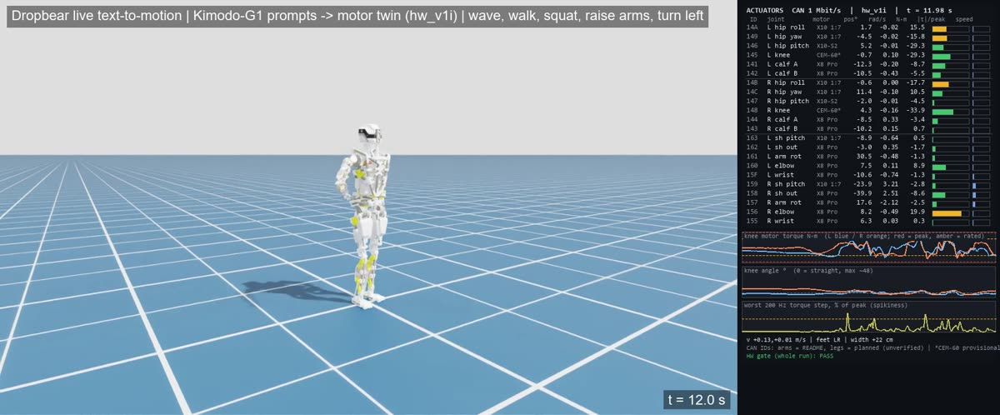
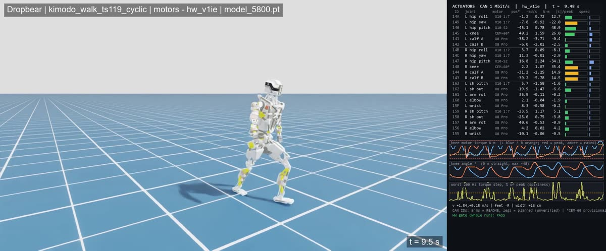
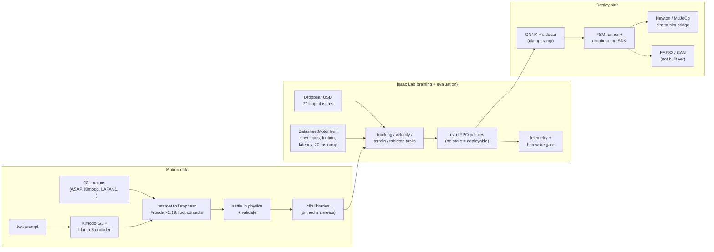

# Dropbear WBC

**Whole-body control for Dropbear, an open-source 3D-printed humanoid: motion tracking, walking, rough terrain and
live text-to-motion, trained and checked on a motor-accurate digital twin in Isaac Lab.**

[](https://github.com/Hyperspawn/dropbear-wbc/actions/workflows/tests.yml)
[](LICENSE)
[](https://huggingface.co/Hyperspawn/dropbear-wbc)
[](https://hyperspawn.github.io/dropbear-wbc/)

**▶ [Watch it in your browser, no install](https://hyperspawn.github.io/dropbear-wbc/)**: recorded physics rollouts in
3D with live per-motor load: the live text-to-motion session, a deployable walk, and a motion the hardware gate rejects.

<table>
<tr>
<td width="50%"></td>
<td width="50%"></td>
</tr>
<tr>
<td>"a person waves hello with the right hand", typed live, generated by Kimodo, played on the motor twin</td>
<td>Deployable walk: no-state policy, datasheet motors, 20 ms target ramp. Hardware gate: PASS</td>
</tr>
</table>

## What this is

Humanoid whole-body-control research mostly targets robots with serial joints and well-documented actuators, like
Unitree's H1 and G1. Dropbear is different, and harder to simulate honestly:

- **Closed kinematic loops.** Knee and elbow four-bars, a parallel ankle and a Stewart-platform neck. A URDF cannot
  represent them, so the plant here is Dropbear's own USD (SHA-256 `45586414…`) with **27 loop-closure joints** that
  PhysX solves every step, not a simplified serial model.
- **Hobby-grade, partly undocumented actuators.** MyActuator X10-S2, X10 1:7, X8 Pro and an EPS-CEM-60 knee whose
  datasheet does not exist. Policies trained on idealized motors fell **18 out of 18** times on the real motor models.

This repository ports the H1/G1 ecosystem to that plant (BeyondMimic motion tracking, G1 motion libraries, velocity
locomotion, a Unitree-style SDK, sim-to-sim, teleop, GR00T data), and adds what an honest sim-to-real path needs: a
**datasheet motor twin**, a **hardware gate** that fails any policy that would overheat, saturate, skid or hammer a
hard stop on the real robot, and a real-time **text-to-motion** loop on a laptop.

Everything here is **simulation**. Nothing has run on the physical robot yet ([what is and is not proven](#honest-status)).

## What's new

| | |
|---|---|
| **Live text to motion, in real time** | Type a motion in a web page; 8.5–10.6 s later the motor twin performs it. The physics runs at 1.0× real time between prompts on a laptop (Isaac CPU pipeline, 18.9 ms per 20 ms step). [TEXT_TO_MOTION](docs/TEXT_TO_MOTION.md) |
| **Datasheet motor twin** | `DatasheetMotor`: per-motor torque-speed envelopes, friction, latency, a 20 ms target ramp. Profiles `hw_v1` / `hw_v1i` / `hw_v1ie`. [ACTUATORS](docs/ACTUATORS.md) |
| **Hardware gate** | `tools/telemetry_issue_scan.py`: 17 checks (thermal, clipping, over-speed, hard-stop loading, skid, slip, scuff, 200 Hz torque jumps, falls…) on every rollout. [ISSUES #22](docs/ISSUES.md) |
| **Deployable walks that pass the gate** | No-state trackers (only what the robot can sense) walking on the real motor models: five walking policies pass, the best at 6.2 cm body error, 0 falls. [RESULTS](docs/RESULTS.md) |
| **Motion libraries** | G1 motion → Dropbear retarget with Froude time scaling (×1.19), physics settling and validation. 138-clip library including 60 Kimodo-generated everyday motions. [DATA](docs/DATA.md) |
| **Library trackers** | One policy tracks 94 of 138 clips without a fall on the motor twin, including 51 of 60 generated motions. |
| **Rough terrain** | Blind velocity walker on stairs and slopes, hardware gate PASS. [TERRAIN](docs/TERRAIN.md) |
| **Deploy runtime** | ONNX export with a policy sidecar, FSM runner, target clamp and ramp, Unitree-style SDK, Newton / MuJoCo sim-to-sim bridge. [SDK](docs/SDK.md) |
| **Teleop and GR00T** | XR / keyboard arm teleop with priority IK; a GR00T tabletop push task and LeRobot dataset. [TELEOP](docs/TELEOP.md), [GROOT](docs/GROOT.md) |

The full dated log is in [WHATSNEW](docs/WHATSNEW.md); the lessons behind the design are in [FINDINGS](docs/FINDINGS.md).

## Results at a glance

All in simulation on the motor twin (Isaac Sim 5.0, Isaac Lab 2.2, 27 closures, datasheet motors). Details and every
source in [RESULTS](docs/RESULTS.md).

| what | result |
|---|---|
| Deployable Kimodo walk (`kimodo_ts119_allfix_smooth/5800`, `hw_v1ie`) | HW gate **PASS**, 0 falls, body error 6.2 cm, target jitter 1.01° |
| LAFAN walk on the provisional CEM-60 knee (`…kstop_feet/3100`) | **PASS**: knee on its hard stop 0.2 % (was 32–45 %), knees 0.94× / 0.82× rated |
| Library tracker `lib_v7gen_v1ie_smooth/13600` | **94/138** clips with 0 falls (51/60 generated, 43/78 original); repeatable run to run |
| Library tracker `lib_v6ts_v1i_fix2/13700` | **46/78** (up from 41/78 and 38/78) |
| Froude time scaling | anchor drift after 15 s: **0.52 m vs 2.04 m** untimed |
| Rough-terrain walker `vel_rough_v1i_b/5500` | **PASS**, 0 falls; legs crossed 2.2 % (was 39 %) |
| Live text-to-motion session (5 prompts) | 0 falls, **PASS**, prompt → motion 8.5–10.6 s, physics 1.0× real time |
| Text encoder on a laptop | Llama-3-8B LLM2Vec as int8, memory-mapped: **1.2 GB** committed instead of 16.4 GB, cosine 0.9995 to bf16 |

## Quick start

```bash
git clone https://github.com/Hyperspawn/dropbear-wbc && cd dropbear-wbc
pip install torch==2.5.1 --index-url https://download.pytorch.org/whl/cpu && pip install -r requirements/tests-cpu.txt huggingface_hub
python -m pytest -q tests -k "not isaac"        # CPU unit tests (no GPU, no Isaac)
python tools/fetch_assets.py                    # the robot USD + trained policies from Hugging Face (~450 MB)
```

With Isaac Sim 5.0 + Isaac Lab 2.2 ([INSTALL](docs/INSTALL.md)), watch a trained policy walk on the motor twin and get
its dashboard and hardware-gate verdict:

```bash
bash tools/make_dashboard.sh assets/policies/kimodo_ts119_allfix_smooth/model_5800.pt \
     data/motions_cyclic/kimodo_walk_ts119_cyclic.npz hw_v1ie kimodo_walk
```

Everything else (library evaluation, training, terrain, sim-to-sim, the live text-to-motion session, cloud training) is
in [QUICKSTART](docs/QUICKSTART.md).

## How it works



## Repository map

| path | contents |
|---|---|
| `source/dropbear_wbc/` | the package: `robots/` (plant, motor twin, names), `tasks/` (tracking, library, locomotion, tabletop), `motion/` (retargeting, streams), `kinematics/` (semantic calibration), `deploy/` + `sdk/` (runtime), `newton_sim/`, `teleop/`, `isaac/` (launch, telemetry, live reference), `paths.py` (machine config) |
| `scripts/` | Isaac entry points: `train.py`, `play.py`, `train_locomotion.py`, `play_locomotion.py`, `render_reference.py`, … |
| `tools/` | pipelines and utilities: retargeting, settling, validation, libraries, dashboards, the hardware gate, export checks, the Newton bridge and runner, teleop, GR00T data, text-to-motion, Brev cloud scripts, asset fetch/publish |
| `data/` | calibration, robot model data, synthetic clips and library manifests ([DATA](docs/DATA.md)) |
| `site/` | the browser demo (GitHub Pages) |
| `docs/` | everything written down ([index](docs/README.md)) |
| `tests/` | CPU unit tests (241 pass in CI on Linux; more run when the optional stacks are installed) |
| `third_party/` | vendored rsl-rl 2.3.3, the Kimodo overlay, the GMR patch ([notices](THIRD_PARTY_NOTICES.md)) |

## Honest status

**Shown in simulation:** closed-loop plant, motor-limited walking and motion tracking that pass the hardware gate,
rough-terrain walking, sim-to-sim transfer to Newton / MuJoCo, and live generated motions in real time.

**Not shown:** anything on the physical robot. The CEM-60 knee values are extrapolated (no datasheet); masses are CAD
estimates; friction, backlash and sensor latency are not measured; the ESP32 firmware's comms-timeout protection is
currently disabled by a byte-offset bug and must be fixed before motors are powered; arm-raised motions overload the
elbow (1.4× rated) through its 4.8× linkage. The full list is in [FINDINGS](docs/FINDINGS.md#open-problems) and
[ISSUES](docs/ISSUES.md).

## Documentation

Start with [docs/README.md](docs/README.md): an index of every document with a one-line summary, and a glossary.
Highlights: [INSTALL](docs/INSTALL.md) · [QUICKSTART](docs/QUICKSTART.md) · [RESULTS](docs/RESULTS.md) ·
[FINDINGS](docs/FINDINGS.md) · [WHATSNEW](docs/WHATSNEW.md) · [CONTRACTS](docs/CONTRACTS.md) (the binding interfaces) ·
[DATA](docs/DATA.md).

## License

**Noncommercial use only**: [PolyForm Noncommercial License 1.0.0](LICENSE) for the code, data, robot model and trained
policies of this project. **For commercial use, contact Hyperspawn**: [hyperspawn.co](https://hyperspawn.co), priyanshu@hyperspawn.co.

Third-party code, models and data keep their own licenses ([THIRD_PARTY_NOTICES](THIRD_PARTY_NOTICES.md)). Some
published policies were trained on LAFAN1 and NVIDIA BONES-SEED sample clips, whose own terms also restrict them to
noncommercial research ([model card](docs/HF_MODEL_CARD.md)).

## Acknowledgements

Built on NVIDIA Isaac Sim / Isaac Lab, Newton, MuJoCo, Kimodo and GR00T; rsl-rl (ETH Zurich RSL); BeyondMimic
whole-body tracking; Unitree's unitree_rl_lab, G1 models and SDK design; GMR (Yanjie Ze et al.); ASAP (LeCAR Lab);
LAFAN1 (Ubisoft La Forge); LLM2Vec (McGill NLP) and Meta Llama 3.
